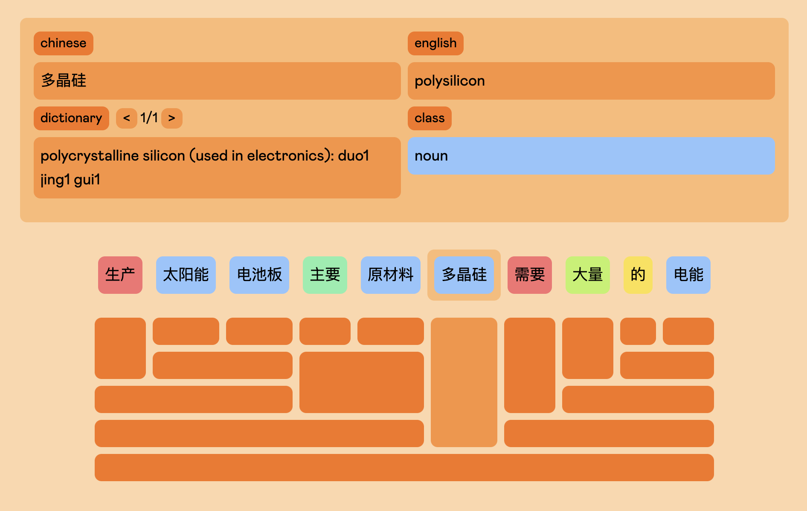

<div align="center">
    <h1>juzi 🍊</h1>

### [Overview 😀](#overview) • [Setup 💻](#setup)


</div>

<div align="center">
    
</div>

## Overview 😀

Juzi is a sentence parser designed to help you break down Chinese sentences into
grammatical components. Each component in the syntax tree presents its own meaning in context to help you understand the overall meaning and structure of the sentence.

Once the parse tree is generated, you can move around with your arrow keys or click on individual nodes. Individual words will also display its dictionary entries as well as it's class in context.

<div align="center">
    
</div>

## Setup 💻

First you'll need to set up the following environment variables. The `KV_*` variables establish connection to the redis database as the dictionary serverless functions rely on Vercel KV. However, feel free to use your own Redis client.

```bash
OPEN_API_KEY=""
KV_URL=""
KV_REST_API_URL=""
KV_REST_API_TOKEN=""
KV_REST_API_READ_ONLY_TOKEN=""
```

Finally, run the dev server:

```bash
# Install dependencies
yarn install

# Run development server
yarn dev
```
